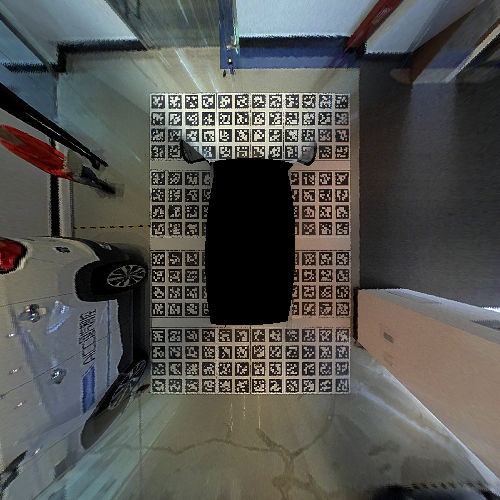

# 1.环境配置

- ubuntu (16.04)
- ROS kinetic
- OpenCV (2.4.9)
- Eigen3

# 2.AVM图像拼接

四个环视相机内参标定文件：

```
./data/calib_right.yaml
./data/calib_front.yaml
./data/calib_left.yaml
./data/calib_rear.yaml
```

相机-车体外参标定文件：

```
./data/calib_extrinsic.yaml
```

程序订阅ROS话题`/mipi_four_cameras/compressed`，消息类型为`sensor_msgs/CompressedImage`，图像分辨率`(1280*4)*720`，为右、前、左、后四个环视相机图像的横向排列。


运行`rosrun avm avm_node`即可完成AVM环视图像生成，发布话题为`/avm_image`。



